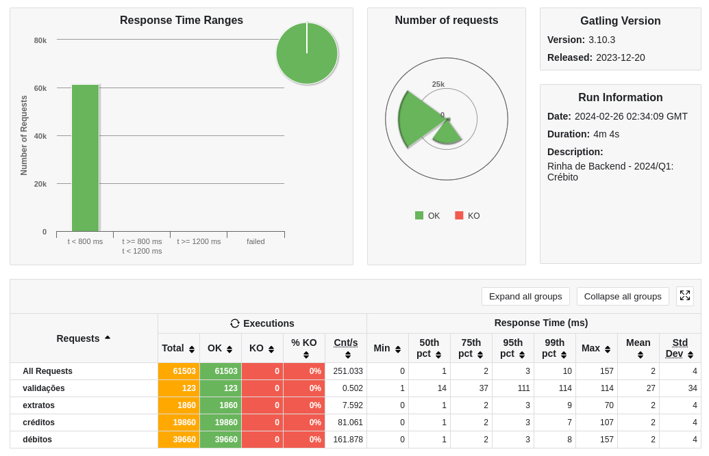

### Rinha de Backend 2024 Q1

Minha implementação para a [rinha-de-backend-2024-q1](https://github.com/zanfranceschi/rinha-de-backend-2024-q1) utilizando a seguinte stack:

### Stack

- Language: Golang 1.22  
- Balance: Nginx  
- Web Framework: [Echo v4](https://github.com/labstack/echo)  
- Database: Postgres  
- Golang Database lib: [dbr v2](https://github.com/gocraft/dbr)  

### Requisitos mínimos:
- Docker
- Go v1.22

### Rodando a aplicação

```bash
go run main.go
```

### Execução do gatling do evento

